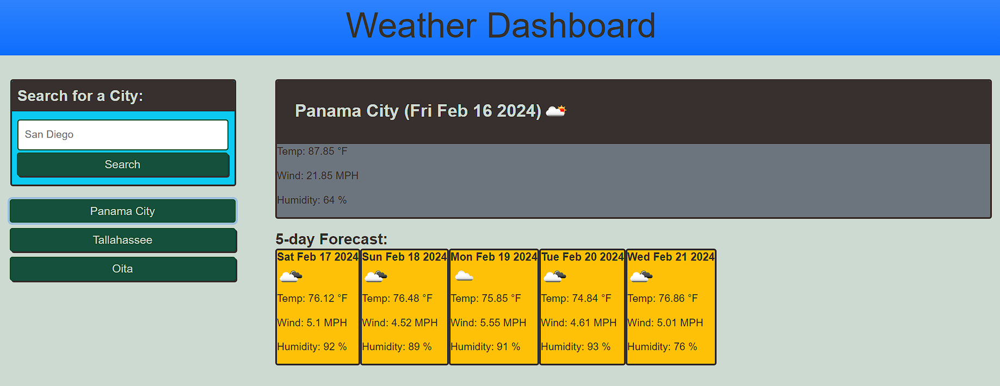

# Weather Dashboard
A simple weather dashboard app that runs in the browser and features dynamically updated HTML and CSS to render a 5-day forecast. Utilizes the OpenWeather API to show you up-to-date weather information.

## User Story

```
AS A traveler
I WANT to see the weather outlook for multiple cities
SO THAT I can plan a trip accordingly
```

## Acceptance Criteria

```
GIVEN a weather dashboard with form inputs
WHEN I search for a city
THEN I am presented with current and future conditions for that city and that city is added to the search history
WHEN I view current weather conditions for that city
THEN I am presented with the city name, the date, an icon representation of weather conditions, the temperature, the humidity, and the wind speed
WHEN I view future weather conditions for that city
THEN I am presented with a 5-day forecast that displays the date, an icon representation of weather conditions, the temperature, the wind speed, and the humidity
WHEN I click on a city in the search history
THEN I am again presented with current and future conditions for that city
```

## Installation and Use

1. Download or clone the repository from GitHub with the link below. Right click the index.html file and open in your browser or choice.
2. Alternatively, navigate to the deployed site with the link below.
3. Click on the white text box and enter the name of a city.
4. Click the 'Search' button just below the text box, and today's as well as for five day's forecasts will populate the page.
5. Searches you make will appear as new green buttons, which you can click to pull that city's weather up again.

## Links

* GitHub: https://github.com/IvanDirigible/weather-dashboard
* Deployed: https://ivandirigible.github.io/weather-dashboard/

## Mock-Up

The following image shows the web application's appearance and functionality:



## Credits
Thanks to Stack Overflow user, [Usagi Miyamoto](https://stackoverflow.com/users/4899193/usagi-miyamoto), for their neat regular expression for returning the first letters of city names as capital letters.

## License
This project is licensed under the MIT license.  
License Link  
https://opensource.org/licenses/MIT   
[]  